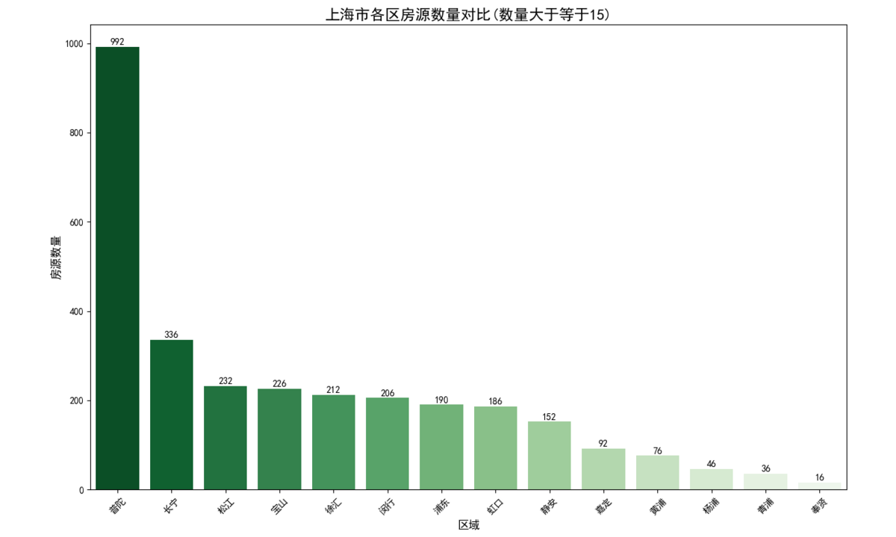
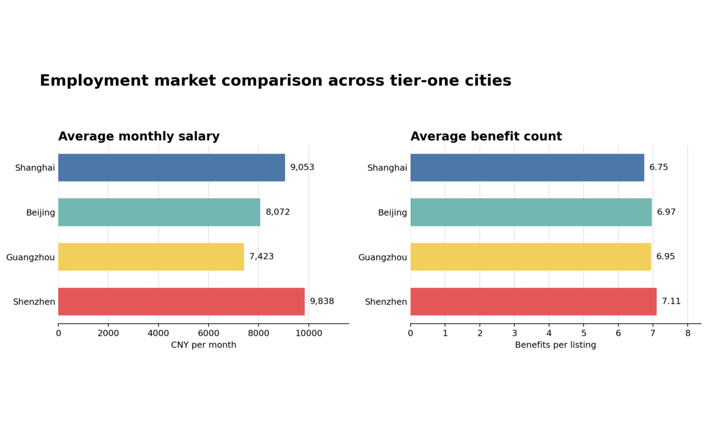
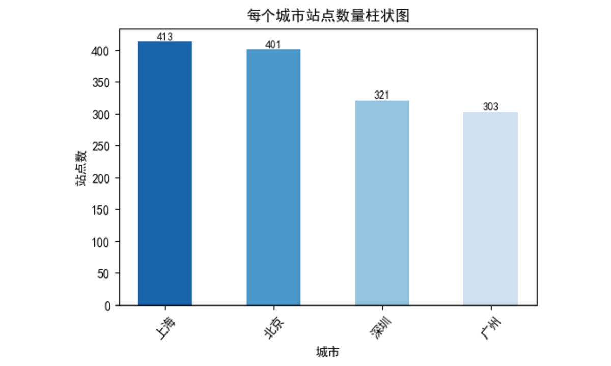
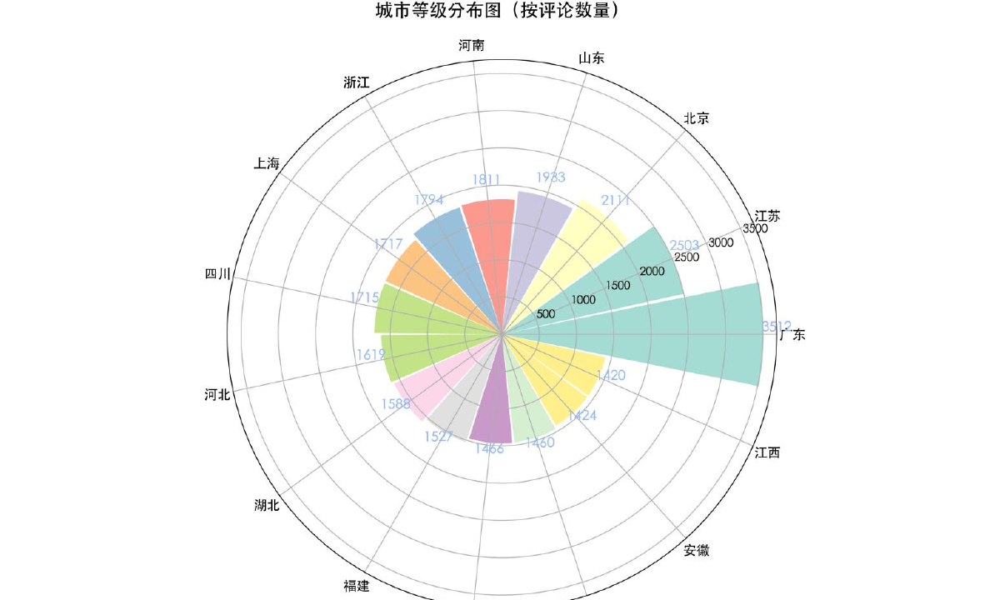
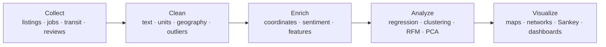

# Multi-Dimensional Analysis of China’s Tier-One Cities

<p align="center">
  An end-to-end data collection and visualization project comparing <strong>Beijing, Shanghai, Guangzhou, and Shenzhen</strong> across consumer preferences, employment, housing, and urban mobility.
</p>

<p align="center">
  <code>Python</code> · <code>R</code> · <code>Web Scraping</code> · <code>GIS</code> · <code>Machine Learning</code> · <code>Interactive Visualization</code>
</p>

Developed as a final project for the Data Collection and Visualization course at Shanghai Jiao Tong University, under the academic guidance of Associate Professor Haifeng Xu.

## Explore the four modules

<table>
  <tr>
    <td width="50%" valign="top">
      <a href="housing_market_analysis/"></a>
      <h3><a href="housing_market_analysis/">Housing Market</a></h3>
      <p>Listing-level prices, housing attributes, regression, clustering, and geospatial comparison across cities and districts.</p>
    </td>
    <td width="50%" valign="top">
      <a href="employment_market_analysis/"></a>
      <h3><a href="employment_market_analysis/">Employment Market</a></h3>
      <p>Recruitment activity, normalized salaries, employee benefits, district patterns, networks, and Sankey diagrams.</p>
    </td>
  </tr>
  <tr>
    <td width="50%" valign="top">
      <a href="urban_mobility_analysis/"></a>
      <h3><a href="urban_mobility_analysis/">Urban Mobility</a></h3>
      <p>Subway accessibility, network structure, station distribution, live traffic layers, and road-congestion analysis.</p>
    </td>
    <td width="50%" valign="top">
      <a href="consumer_preference_analysis/"></a>
      <h3><a href="consumer_preference_analysis/">Consumer Preferences</a></h3>
      <p>More than 50,000 JD.com reviews analyzed through sentiment scoring, RFM, PCA, regional mapping, and text visualization.</p>
    </td>
  </tr>
</table>

## Project overview

Rapid urban development cannot be understood through a single indicator. This project connects four perspectives to build a richer profile of China’s tier-one cities:

| Dimension | Core question | Main methods |
|---|---|---|
| Housing | How do prices and housing characteristics vary across and within cities? | Web scraping, geocoding, regression, clustering, geospatial visualization |
| Employment | How do job supply, salary, and employee benefits differ by city and district? | Web scraping, text processing, outlier detection, heatmaps, Sankey diagrams |
| Mobility | How accessible are subway systems, and how severe is road congestion? | API collection, GIS processing, network and time-series visualization |
| Consumer preferences | How do purchasing behavior and review sentiment vary across regions? | Browser automation, sentiment analysis, RFM, PCA, word clouds |

## End-to-end workflow



## Selected outputs

- Interactive housing-price distributions, price–area relationships, Sankey diagrams, and city maps
- Cross-city salary and benefit comparisons, spatial views, network diagrams, and occupation flows
- Subway network and station-count comparisons alongside time-based road-congestion analysis
- Regional review sentiment, membership patterns, customer segments, maps, radar charts, and word clouds

Several interactive visualizations are committed as standalone HTML files and can be opened directly after cloning the repository.

## Repository structure

```text
.
├── housing_market_analysis/       # Second-hand housing data and visualizations
├── employment_market_analysis/    # Recruitment, salary, and benefits analysis
├── urban_mobility_analysis/       # Subway networks and road congestion
├── consumer_preference_analysis/  # JD.com reviews and regional preferences
├── docs/
│   ├── images/                    # README visual previews
│   └── original_reports_zh/       # Original Chinese course reports
├── requirements.txt
└── LICENSE
```

Each module contains its own README with its research design, workflow, file guide, and usage notes.

## Technology stack

| Area | Tools |
|---|---|
| Languages | Python, R |
| Collection | Requests, Beautiful Soup, Parsel, DrissionPage |
| Analysis | pandas, NumPy, scikit-learn, statsmodels, SnowNLP, jieba |
| Visualization | Matplotlib, Seaborn, Plotly, Pyecharts, Folium, GeoPandas, Cartopy, NetworkX, WordCloud |
| Geospatial | AMap data and APIs, ArcGIS-compatible shapefiles |

## Getting started

```bash
git clone https://github.com/Yiyang-3/china-tier-one-city-analysis.git
cd china-tier-one-city-analysis
python -m venv .venv
pip install -r requirements.txt
```

Open the README inside the module you want to explore. Several collection scripts require live websites, browser sessions, API credentials, or current request headers. Pre-collected datasets and exported visualizations are included so the project can still be reviewed without rerunning every scraper.

If a collector requires an authenticated session, store current session values locally and never commit cookies or credentials.

## Data sources and responsible use

- [Lianjia](https://www.lianjia.com/) second-hand housing listings
- [58.com](https://www.58.com/) recruitment listings
- [AMap](https://www.amap.com/) subway and traffic services
- [JD.com](https://www.jd.com/) product pages and reviews

The data was collected from publicly accessible pages for academic analysis. Website structures, terms, robots policies, and rate limits may change. Review current requirements before rerunning any collector and do not use this repository for commercial data extraction.

## License

Code is released under the [MIT License](LICENSE). Third-party datasets and platform content remain subject to their original terms and rights.
